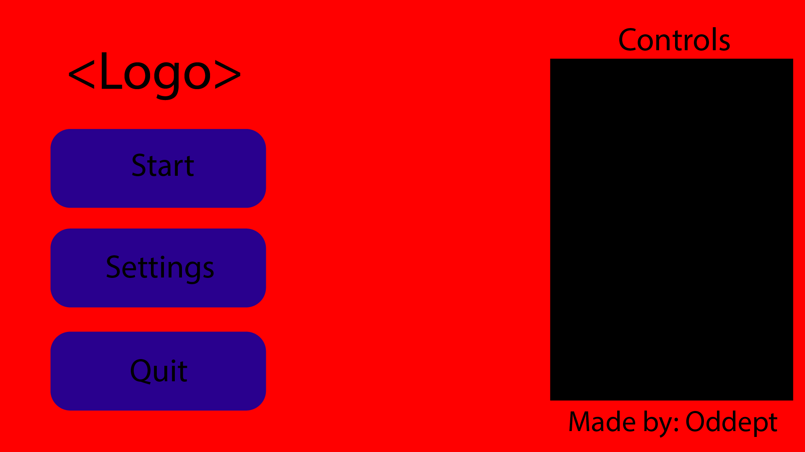
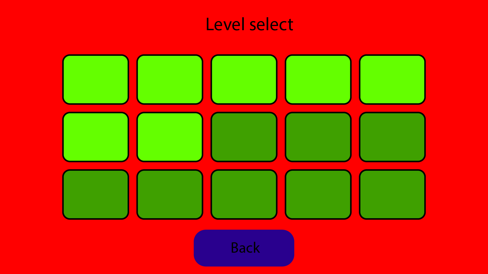
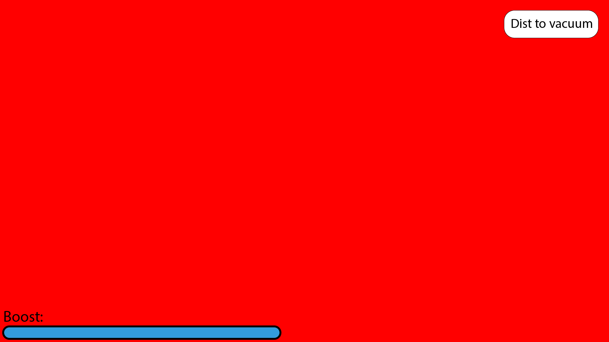
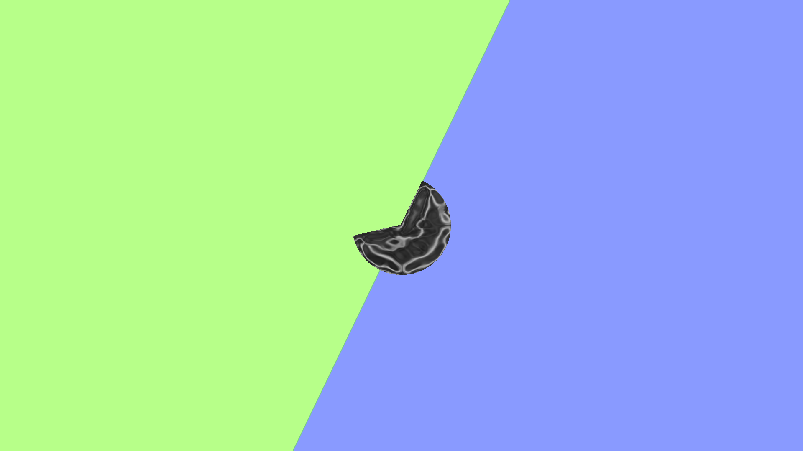
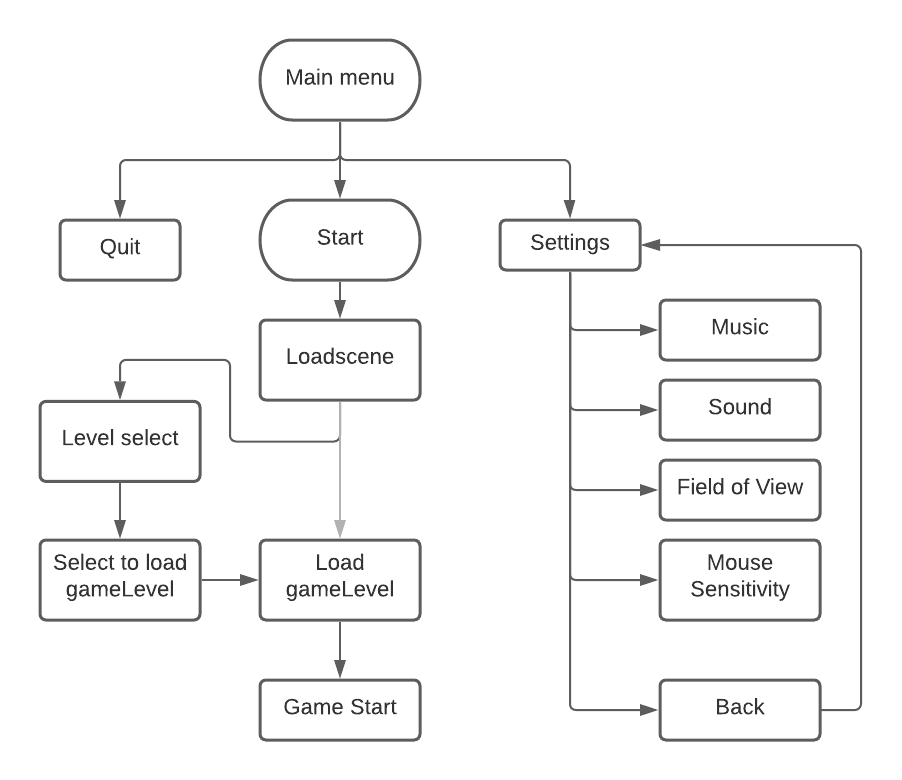
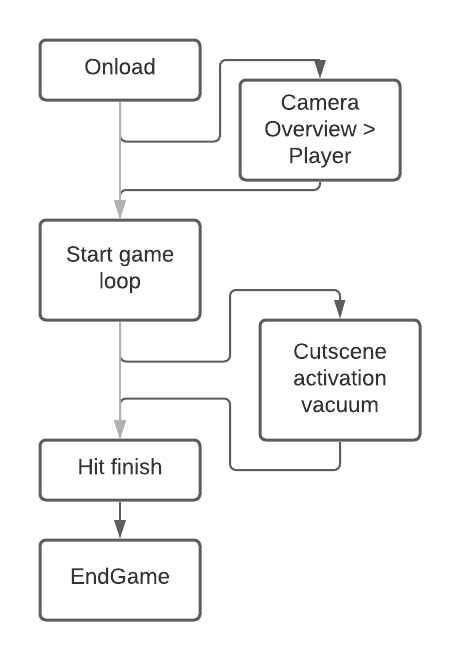

# Chapters
1. [General Information](#general)
2. [Indepth Information](#Indepth-Information)
3. [User interface](#User-interface)
4. [Game flow](#game-flowchart)
 

## general
<h4 style="color: rgb(190, 190, 190);">Concept</h4>

You play from a dogs point of view. A roomba takes over an old style vacuum cleaner and begins chasing you. There is only one way out of the building to safety and there are various hurdles in the way.

## Indepth-Information
Players: Singeplayer.
Objective: Get out of the level and into the next level.
Rewards: Level completion.

Objectives:
 

<h4 style="color: rgb(190, 190, 190);">Frameworks</h4>
Unity (C#)
 

<h4 style="color: rgb(190, 190, 190);">Requirements</h4>
installation on the PC
 

## User-interface
Menu's:
- Dark blue: Button
- Light blue: Slider
- Black box: Control scheme Keyboard + Controller
- Yellow box: Selectable level
- Green box: Unselectable level

Start menu:

 

Setting menu:

 

Level select (unused):

 

Ingame:
- Blue bar: Amount of boost
- White rectangle: Display distance to the vacuum cleaner

 

Loading screen (unused):
The half cut sides slide in from their respective side, goes into loading mode. 
The small circle in the center fills with the amount of completion. 
When done loading the level it slides open again and enables the character movement.

 

## Game-flowchart:
If there is a split and one of the arrows is grey:
The light gray arrow takes priority, the other arrow would be a could have, but is not a must have for the wanted experience.

On opening the game:

 

On level load:
