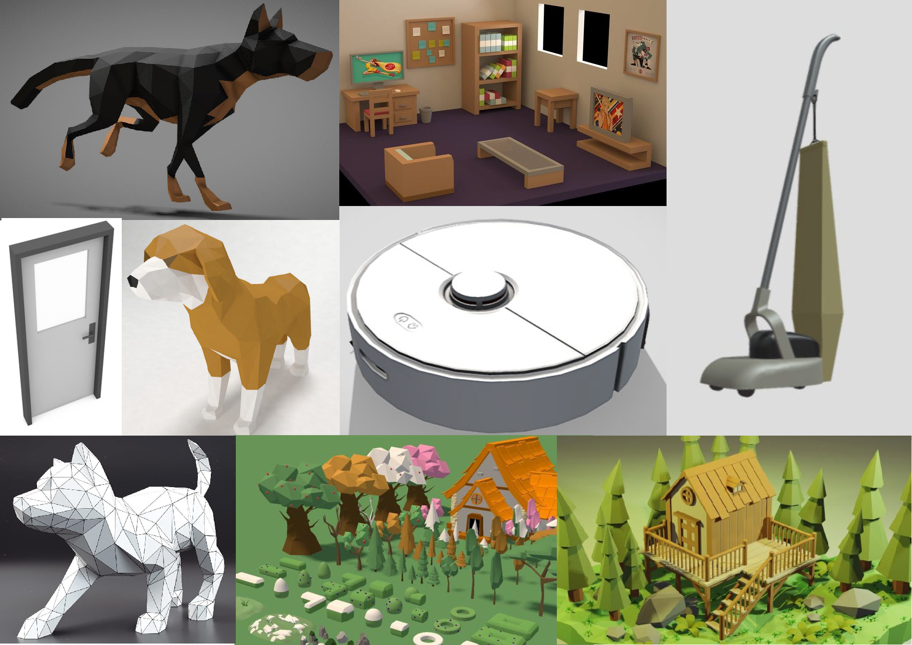
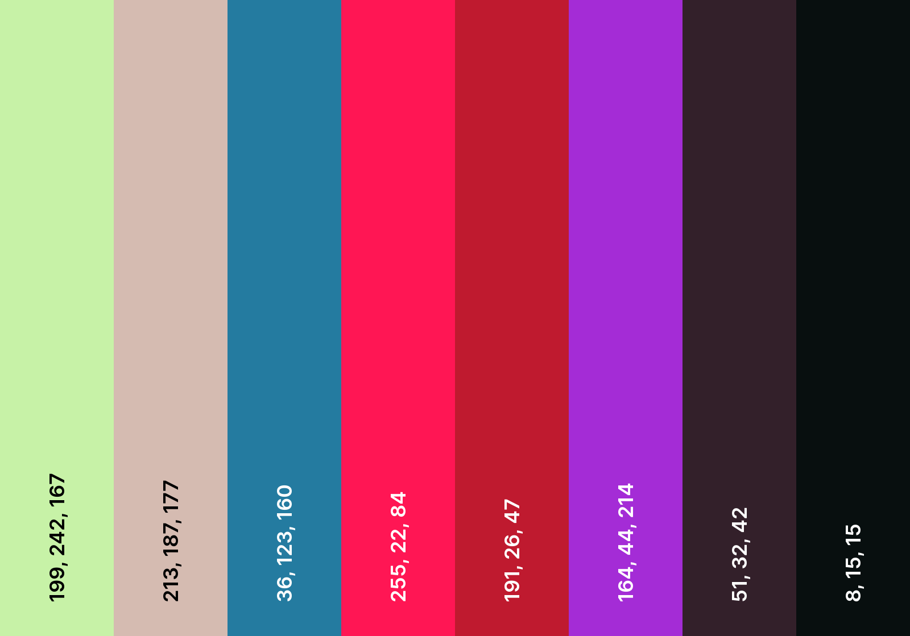

## General information:
### Concept:
Description: You play from a dogs point of view. A roomba takes over an old style vacuum cleaner and begins chasing you. There is only one way out of the building to safety and there are various hurdles in the way. 

The story is that the roomba is killing you... that's it. Story writing :cool
Target demographic: 13+, Is paced for fun and hectic chaos. 

           
### Formal elements:
**Narrative:** Play, Challenge
**Players:** Single-player
**Player mode:** Casual, Race.  
**Premises:** Story, Introduction, Logo, Launch page.  
**Objectives:** Get out of the current room.

**Resources:** Physics objects (push out of the way).

### Controls:
| Control     | Keyboard | Controller | Ingame action |
| :----: |    :----:   | :----: |  :---:  |
|  Movement   | WASD | Left Joystick  | Movement in the given direction/Menu navigation  |
| Boost   | Secondary button (shift/control) | Secondary button | Up the speed |
| Jump  |  Space | Primary button | Character jumps up and get's dragged down by gravity |

           

### Rules:

- Can't go through map
- Can push physics objects
- Can jump onto platforms
- Follow an unclear path with a few shortcuts
- If you are touched by the vacuum cleaner you've lost
- The vacuum follows the player

           

**Conflict**: Getting stuck on map, nearing vacuum cleaner, finding the right path.
**Outcomes**: Survival basis.

### MDA:
**Aesthetics:**
- Challenge
- Submission  
- Discovery

**Dynamics:**  
Challenge: Against other players and working with what you get.  
Submission: It is a game for hectic chaos which is meant to be fun. It’s mainly here pastime.
Discovery: Learn how and what to use in situations, Discover the arena and racetracks and shortcuts.  

  
**Mechanics:**
- Movement
- Speed of vacuum and dog
- Boosting
- Physics objects
  

## MoSCoW:
Must:
- 1 level
- Movement
- Follow/Pathfinding AI (navmesh)

Should:
- Good art
- Fitting music

Could: 
- Sneaking
- Simple puzzles
- Dialogue system
- Shop/Cosmetics

Won't: 
Multiplayer

## Style
### Moodboard:

### Colour palette:

