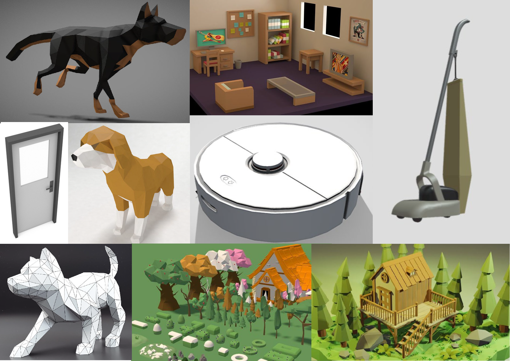
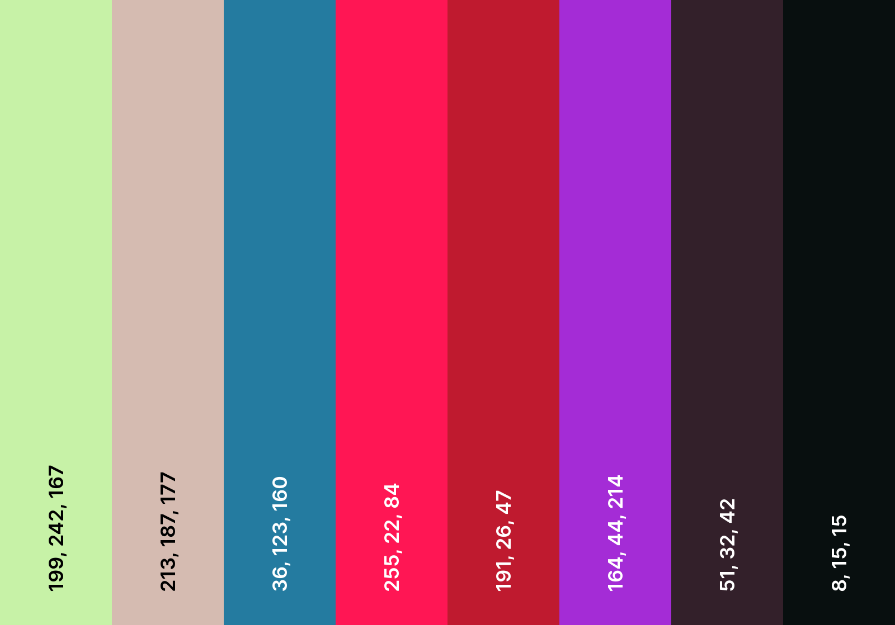
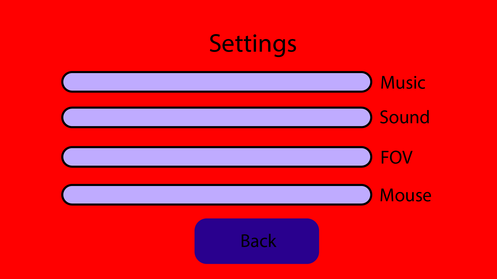

# Chapters
1. [General Information](#general)
2. [Indepth Information](#Indepth-Information)
3. [Mechanics, Dynamics and Aesthetics](#MDA)
4. [Game Style](#Style)
5. [Must, Should, Could and Won't haves](#MoSCoW)
6. [User interface](#User-interface)
7. [Game flow](#game-flowchart)
 

## general
<h4 style="color: rgb(190, 190, 190);">Concept</h4>

You play from a dogs point of view. A roomba takes over an old style vacuum cleaner and begins chasing you. There is only one way out of the building to safety and there are various hurdles in the way.

You die on collision with the vacuum cleaner, got a limited amount of boost which slowly regenerates after not using it. Got a few physics objects you can push through for shortcuts but it's not necessary.

The story is that the roomba is killing you... that's it. Story writing :cool
Target demographic: 13+, Is paced for fun and hectic chaos. 

## Indepth-Information
**Players**: Singeplayer.
**Objective**: Get out of the level and into the next level.
**Rewards**: Level completion.

**Revenue-model**: Free, Donations
**Advertising**: None, face-to-face

**Conflict**: Getting stuck on map, nearing vacuum cleaner, finding the right path.
**Outcomes**: Survival basis.
 

<h4 style="color: rgb(190, 190, 190);">Formal Elements</h4>

**Narrative:** Play, Challenge
**Players:** Single-player
**Player mode:** Casual, Race.  
**Premises:** Story, Introduction, Logo, Launch page.  
**Objectives:** Get out of the current room.

**Resources:** Physics objects (push out of the way).
 

<h4 style="color: rgb(190, 190, 190);">Controls</h4>

| Control     | Keyboard | Controller | Ingame action |
| :----: |    :----:   | :----: |  :---:  |
|  Movement   | WASD | Left Joystick  | Movement in the given direction/Menu navigation  |
| Boost   | Secondary button (shift/control) | Secondary button | Up the speed |
| Jump  |  Space | Primary button | Character jumps up and get's dragged down by gravity |
 

<h4 style="color: rgb(190, 190, 190);">Rules</h4>

- Can't go through map
- Can push physics objects
- Can jump onto platforms
- Follow an unclear path with a few shortcuts
- If you are touched by the vacuum cleaner you've lost
- The vacuum follows the player
 

<h4 style="color: rgb(190, 190, 190);">Frameworks</h4>
Unity (C#)
 

<h4 style="color: rgb(190, 190, 190);">Requirements</h4>
installation on the PC
 

## MDA:
**Aesthetics:**
- Challenge
- Submission  
- Discovery

**Dynamics:**  
Challenge: Against other players and working with what you get.  
Submission: It is a game for hectic chaos which is meant to be fun. It’s mainly here pastime.
Discovery: Learn how and what to use in situations, Discover the arena and racetracks and shortcuts.  

  
**Mechanics:**
- Movement
- Speed of vacuum and dog
- Boosting
- Physics objects
  

## Style
### Moodboard:

### Colour palette:

 

## MoSCoW:
**Must**:
- 1 level
- Movement
- Follow/Pathfinding AI (navmesh)

**Should**:
- Good art
- Fitting music

**Could**: 
- Sneaking
- Simple puzzles
- Dialogue system
- Shop/Cosmetics

**Won't**: 
- Multiplayer
 

## User-interface
Menu's:
- Dark blue: Button
- Light blue: Slider
- Black box: Control scheme Keyboard + Controller
- Yellow box: Selectable level
- Green box: Unselectable level

Start menu:

 

Setting menu:

 

Level select (unused):

 

Ingame:
- Blue bar: Amount of boost
- White rectangle: Display distance to the vacuum cleaner

 

Loading screen (unused):
The half cut sides slide in from their respective side, goes into loading mode. 
The small circle in the center fills with the amount of completion. 
When done loading the level it slides open again and enables the character movement.

 

## Game-flowchart:
If there is a split and one of the arrows is grey:
The light gray arrow takes priority, the other arrow would be a could have, but is not a must have for the wanted experience.

On opening the game:

 

On level load:
