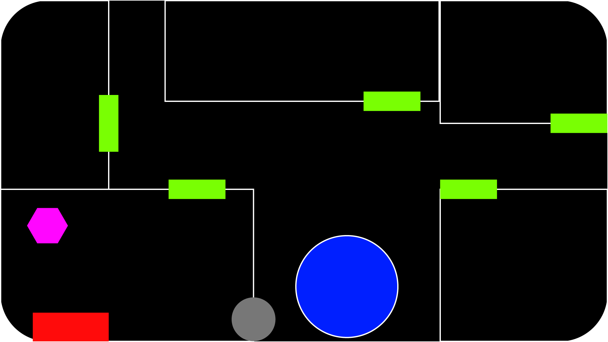
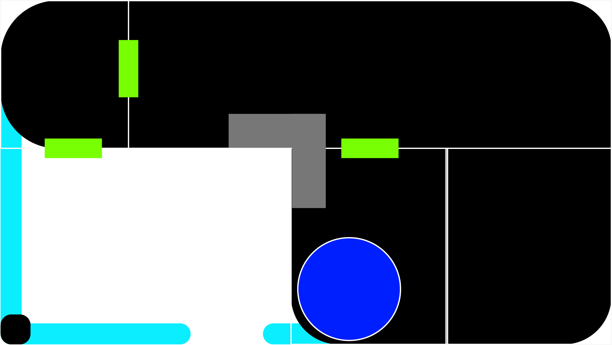
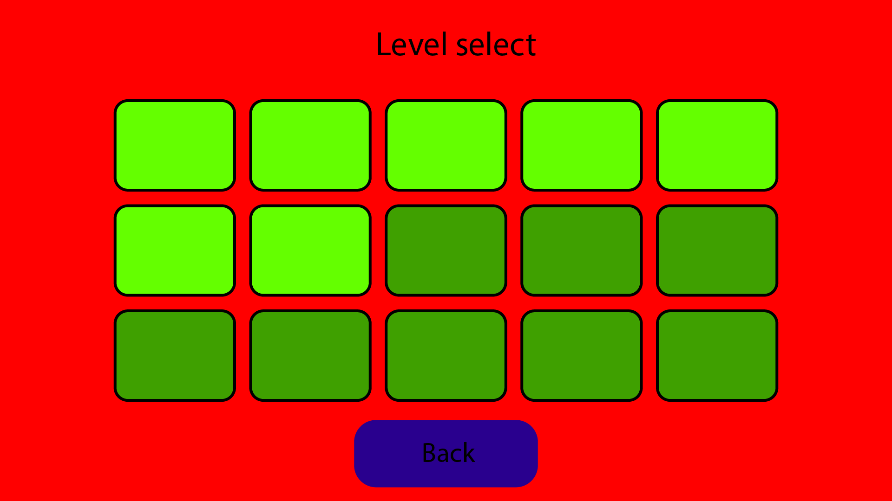
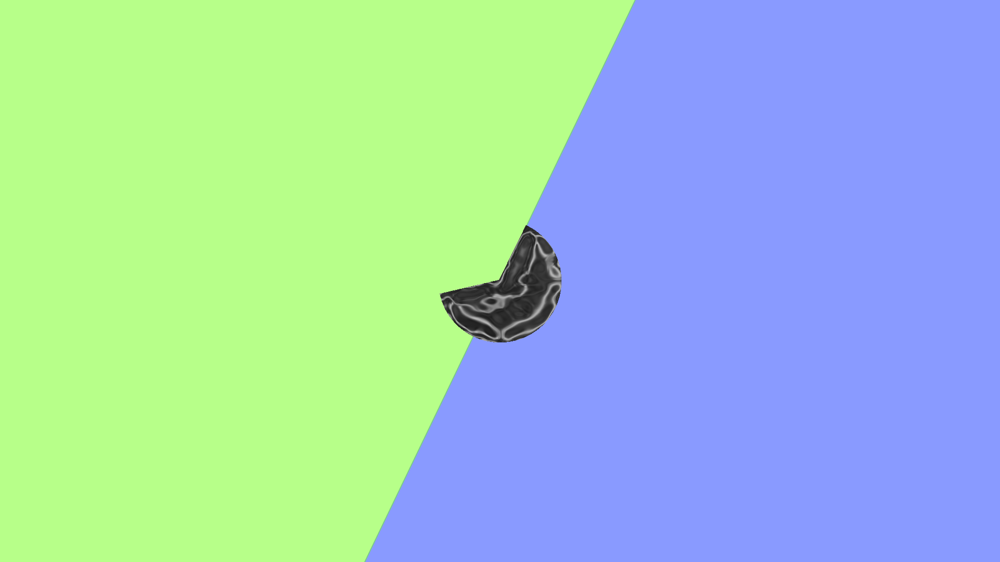

# Chapters
1. [General Information](#general)
2. [Indepth Information](#Indepth-Information)
3. [Mechanics, Dynamics and Aesthetics](#MDA)
4. [Game Style](#Style)
5. [Must, Should, Could and Won't haves](#MoSCoW)
6. [User interface](#User-interface)
7. [Game flow](#game-flowchart)
8. [Code Structure](#Code-Structure)
 

## general
<h4 style="color: rgb(132, 168, 192);">Concept</h4>

You play from a dogs point of view. A roomba takes over an old style vacuum cleaner and begins chasing you. There is only one way out of the building to safety and there are various hurdles in the way.

You die on collision with the vacuum cleaner, got a limited amount of boost which slowly regenerates after not using it. Got a few physics objects you can push through for shortcuts but it's not necessary.

The story is that the roomba is killing you... that's it. Story writing :cool
 

## Indepth-Information
**Platform**: PC (Windows 10). Other platforms might get ports. 
**Target demographic/audience**: 13+, Is paced for fun and hectic chaos.  
**Players**: Singeplayer, First person.  
**Objective**: Get out of the level and into the next level.  
**Rewards**: Level completion.  
**Difficulty**: normal, one level.  
**Scoring system**: Based on either speed of level completion (time trial) and/or level completion.  

**Revenue-model**: Free, Donations.  
**Advertising**: None, face-to-face.  

**Conflict**: Getting stuck on map, nearing vacuum cleaner, finding the right path.
**Outcomes**: Survival basis.
<h4 style="color: rgb(132, 168, 192);">Scope</h4>

This includes:
- An Unity Engine based game.
- Some low poly art.
- Prototype music.

This doesn't include:
- Professional grade art.
- Professional grade sound design.

Needed for this project:
- One Developer with interest in Art, Sound design, Music. Animation is a plus but these could be done in engine.
- A PC capable of running [Unity](https://unity.com), [Blender](https://blender.org/) and a wanted DAW (Likely [FL Studio](https://image-line.com) or [Ableton](https://ableton.com) as they are the market standerd).
- A fitting IDE (integrated development environment) for coding purposes. Likely Jetbrains [Rider](https://www.jetbrains.com/rider/) or [Visual Studio Code](https://visualstudio.microsoft.com/).
- A PC capable of making a game build.
- Free range for experimentation with level design, features and pacing.
 

<h4 style="color: rgb(132, 168, 192);">Formal Elements</h4>

**Narrative:** Play, Challenge. 
**Players:** Single-player. 
**Player mode:** Casual, Race.  
**Premises:** Story, Introduction, Logo, Launch page.  
**Objectives:** Get out of the current room. 

**Resources:** Physics objects (push out of the way).
 

<h4 style="color: rgb(132, 168, 192);">Controls</h4>

| Control     | Keyboard | Controller | Ingame action |
| :----: |    :----:   | :----: |  :---:  |
|  Movement   | WASD | Left Joystick  | Movement in the given direction/Menu navigation  |
| Boost   | Secondary button (shift/control) | Secondary button | Up the speed |
| Jump  |  Space | Primary button | Character jumps up and get's dragged down by gravity |
 

<h4 style="color: rgb(132, 168, 192);">Rules</h4>

- Can't go through map.
- Can push physics objects.
- Can jump onto platforms.
- Follow an unclear path with a few shortcuts.
- If you are touched by the vacuum cleaner you've lost.
- The vacuum follows the player.
 

<h4 style="color: rgb(132, 168, 192);">Frameworks</h4>
Unity (C#).
 

<h4 style="color: rgb(132, 168, 192);">Requirements</h4>
installation on the PC.
 

## MDA:
**Aesthetics:**
- Challenge.
- Submission .
- Discovery.

**Dynamics:**  
Challenge: Against other players and working with what you get.  
Submission: It is a game for hectic chaos which is meant to be fun. It’s mainly here pastime.
Discovery: Learn how and what to use in situations, Discover the arena and racetracks and shortcuts.  

  
**Mechanics:**
- Movement.
- Speed of vacuum and dog.
- Boosting.
- Physics objects.
  

## Style
Art: Lowpoly, brightly coloured, simplistic.

### Moodboard:

### Colour palette:

 

### Map design:
**Style**: Crowded.  
**Make interesting**: Physics object placement, Shortcuts.  
**Planned route**: Start upstairs, run through the bedroom > hallway > Stairs > Kitchen > Living room > Hallway to front door > Front garden > outside garder (win).  
**Shortcuts**: 
- bedroom to stairs (corner skip) by jumping through a hole.
- Stair to living room by jumping through vent.

**Vacuum on shortcuts**: If a player takes a shortcut, speed up or teleport.  

**Level design lookout**: Make doors glow, obstruct shortcuts but make them visible by giving them a certain style of placement (must seem a bit off, like skewed). Check colour of objects, make similar use objects have a defined colour so that the player sees that a physics object is a physics object faster.  

Level:
- White squares: rooms.
- Yellow squares: doors.
- Pink hexagon: spawnpoint.
- Dark blue circle with white ring: Stairs (links between top and bottom).
- Red Square: Closet with vacuum in it.
- Gray circle: Hole in wall shortcut.
- Gray Square: Vent/top of lamp shortcut.
- Black: House/Inside
- Light blue: Fence (outside)

Top layout:

Bottom layout:

 

### Audio and sound effects:
<h4 style="color: rgb(132, 168, 192);">Sound effects</h4>
Style: Simplistic, heigh notes.

- Menu onClick sound.
- Level switch sound effect.
- Game Over Sound effect.

<h4 style="color: rgb(132, 168, 192);">Music</h4>
Style: Upbeat, fast paced, Hyper.

- Menu background music.
- Ingame soundtrack.

## MoSCoW:
**Must**:
- 1 level.
- Movement.
- Follow/Pathfinding AI (navmesh).

**Should**:
- Good art.
- Fitting music.

**Could**: 
- Sneaking.
- Simple puzzles.
- Dialogue system.
- Shop/Cosmetics.

**Won't**: 
- Multiplayer.
 

## User-interface
Menu's:
- Dark blue: Button.
- Light blue: Slider.
- Black box: Control scheme Keyboard + Controller.
- Yellow box: Selectable level.
- Green box: Unselectable level.

Start menu:

 

Setting menu:

 

Level select (unused):

 

Ingame:
- Blue bar: Amount of boost.
- White rectangle: Display distance to the vacuum cleaner.

 

Loading screen (unused):
The half cut sides slide in from their respective side, goes into loading mode. 
The small circle in the center fills with the amount of completion. 
When done loading the level it slides open again and enables the character movement.

 

## Game-flowchart:
If there is a split and one of the arrows is grey:
The light gray arrow takes priority, the other arrow would be a could have, but is not a must have for the wanted experience.

On opening the game:

 

On level load:

 

## Code-Structure
Using Unity C# and fitting libraries (for UI, Input System, etc).
Using Unity C# as it is a small, low poly game and since I have experience working with it.
Not using Unity ECS as I don't need networking nor do I need the optimisations for this project.

Physics handled by Unity RigidBody for simplicity purposes.

**Unity packages**:
- Input System
- NavMesh
- Cinemachine
- TextMeshPro
- ProBuilder

<h4 style="color: rgb(132, 168, 192);">Classes</h4>
**AIMovement.cs**:
Has the navmesh of the level on it.
Has the dog (target) transform/location on it.
Moves the AI accordingly by setting a point on the map closest to the target.

**PlayerMovement.cs**:
Handles the player movement.