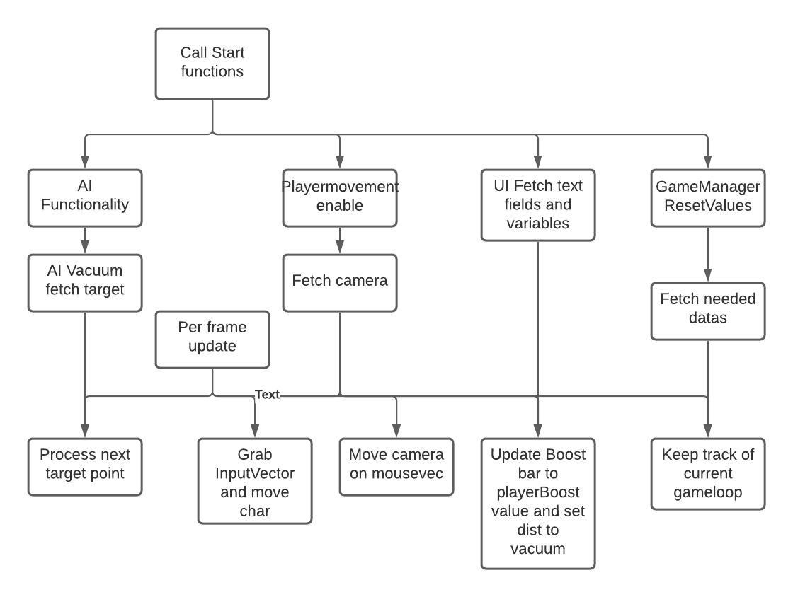

# Chapters
1. [scope](#scope)
2. [Game flow](#game-flowchart)
3. [Code Structure](#Code-Structure)
   

## Scope
This includes:  
- An Unity Engine based game.
- Some low poly art.
- Prototype music.

This doesn't include:  
- Professional grade art.
- Professional grade sound design.  

Needed for this project:
- One Developer with interest in Art, Sound design, Music. Animation is a plus but these could be done in engine.
- A PC capable of running [Unity](https://unity.com), [Blender](https://blender.org/) and a wanted DAW (Likely [FL Studio](https://image-line.com) or [Ableton](https://ableton.com) as they are the market standerd).
- A fitting IDE (integrated development environment) for coding purposes. Likely Jetbrains [Rider](https://www.jetbrains.com/rider/) or [Visual Studio Code](https://visualstudio.microsoft.com/).
- A PC capable of making a game build.
- Free range for experimentation with level design, features and pacing.  
   

<h4 style="color: rgb(132, 168, 192);">MoSCoW</h4>  
**Must**:
- 1 level.
- Movement.
- Follow/Pathfinding AI (navmesh).

**Should**:
- Good art.
- Fitting music.

**Could**: 
- Sneaking.
- Simple puzzles.
- Dialogue system.
- Shop/Cosmetics.
- A video trailer + Social Media Presence

**Won't**: 
- Multiplayer.
 

## Code-Structure
### Target Platform
**Launch platform**: Windows 10.  
**Game engine**: Unity Engine. 
**Versions**:
- Unity: 2020.3 LTS
- Blender: 2.93 LTS
   
  
**Why Unity**:
- Using Unity C# and fitting libraries (for UI, Input System, etc).  
- Using Unity C# as it is a small, low poly game and since I have experience working with it. Unity runs 3D and is good for a 
- Not using Unity ECS as I don't need networking nor do I need the optimisations for this project.  

Physics handled by Unity RigidBody for simplicity purposes.

**Unity packages**:
- Input System
- NavMesh
- Cinemachine
- TextMeshPro
- ProBuilder
 

<h4 style="color: rgb(132, 168, 192);">System requirements</h4>

- 1920 x 1080 screen (1080p)  
- Decent CPU and GPU  
- 256GB storage (dev), 10GB (Player)  
 

<h4 style="color: rgb(132, 168, 192);">Classes + Methods</h4>  

**AIMovement : MonoBehaviour**:  
Has the navmesh of the level on it.  
Has the dog (target) transform/location on it.  
Moves the AI accordingly by setting a point on the map closest to the target.  

**PlayerMovement: MonoBehaviour**:  
Handles the player movement.  
Handles the player physics.  

**GameManager  : MonoBehaviour**:  
Is an instance (can go between scenes)
Keeps track of gamestate.  
Has the play score.  
Calls the scene switching and is a script between other scripts.  
Runs the gameloop.  

**UIScript : MonoBehaviour**:  
Calls SceneManager.  

**SceneManager : MonoBehaviour**:  
Manages scene loading screen + switching.  
   
<h4 style="color: rgb(132, 168, 192);">General Architecture</h4>  
   
<h4 style="color: rgb(132, 168, 192);">Models + Art</h4>  

**UI ** 
>Button
>Font
>Slider
>Slider nob
> Background
> Loading screen slice left
> Loading screen slice right
> Loading screen symbol

**Game General**
> Vacuum cleaner
> Roomba
> Dog

**Game Level 1**
> Wall
> Wall with hole
> Wall with door frame
> Door
> Closet
> Stairs
> Boxes
> Kitchen with sink
> Vent/Hanging Lamp
   

## Game-flowchart:
If there is a split and one of the arrows is grey:
The light gray arrow takes priority, the other arrow would be a could have, but is not a must have for the wanted experience.

On opening the game:

 

On level load:

 

Gameloop indepth:

   