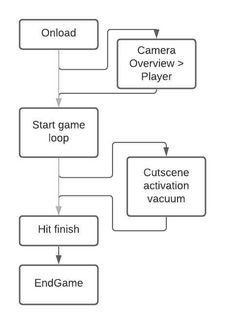
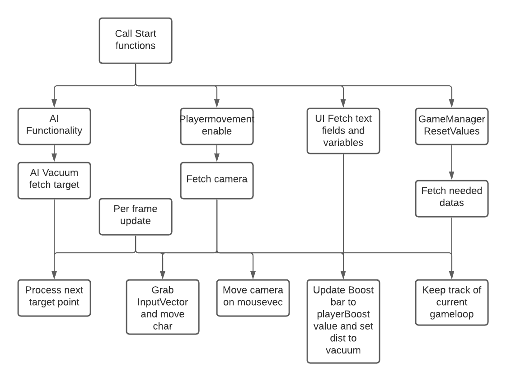

# Chapters
1. [scope](#scope)
2. [Technical Details](#Technical-details)
3. [General Structure](#Code-Structure)
4. [Assets](#Assets)
5. [Optimisation](#Game-optimisation)
6. [Game flow](#game-flowchart)
   

Needed for this project:
- One Developer with interest in Art, Sound design, Music. Animation is a plus but these could be done in engine.
- A PC capable of running [Unity](https://unity.com), [Blender](https://blender.org/) and a wanted DAW (Likely [FL Studio](https://image-line.com) or [Ableton](https://ableton.com) as they are the market standerd).
- A fitting IDE (integrated development environment) for coding purposes. Likely Jetbrains [Rider](https://www.jetbrains.com/rider/) or [Visual Studio Code](https://visualstudio.microsoft.com/).
- A PC capable of making a game build.
- Free range for experimentation with level design, features and pacing.  
- Possible personal sound recording requires a decent microphone and software like [Audacity](https://www.audacityteam.org/)
   

## Technical-details
### Target Platform
**Launch platform**: Windows 10.  
**Game engine**: Unity Engine. 
**Versions**:
- Unity: 2020.3 LTS
- Blender: 2.93 LTS
   
  
<h4 style="color: rgb(132, 168, 192);">Frameworks</h4>
Unity (C#).
 

<h4 style="color: rgb(132, 168, 192);">Requirements</h4>
installation on the PC.
 
  
**Why Unity**:
- Using Unity C# and fitting libraries (for UI, Input System, etc).  
- Using Unity C# as it is a small, low poly game and since I have experience working with it. Unity runs 3D and is good for an indie game.
- Not using Unity ECS as I don't need networking nor do I need the optimisations for this project.  

Physics handled by Unity RigidBody for simplicity purposes. It wouldn't fit the scope otherwise.  
Only certain items that need be will have physics applied to them, this includes but is not limited to: The player, Blocking object.

**Unity packages**:
- Input System
- NavMesh
- Cinemachine
- TextMeshPro
- ProBuilder
 

<h4 style="color: rgb(132, 168, 192);">System requirements</h4>  

Developer:
- Monitor Minimal 1920 x 1080 screen (1080p) and 60FPS
- Very good CPU and GPU 
- 128GB storage HDD       
- 16GB ram
- keyboard + mouse and Controller (both for dev)
- Headset + Speakers
- Windows 10

Player
- Dual Core CPU
- Recent GPU
- 4GB storage (Player)  
- 4-8GB ram
- keyboard + mouse or Controller
- Windows 10
   

## Code-Structure
**AIMovement : MonoBehaviour**:  
Has the navmesh of the level on it.  
Has the dog (target) transform/location on it.  
Moves the AI accordingly by setting a point on the map closest to the target.  

**PlayerMovement: MonoBehaviour**:  
Handles the player movement.  
Handles the player physics.  

**GameManager  : MonoBehaviour**:  
Is an instance (can go between scenes)
Keeps track of gamestate.  
Has the play score.  
Calls the scene switching and is a script between other scripts.  
Runs the gameloop.  

**UIScript : MonoBehaviour**:  
Calls SceneManager.  

**SceneManager : MonoBehaviour**:  
Manages scene loading screen + switching.  
   
<h4 style="color: rgb(132, 168, 192);">General Architecture</h4>  
   
<h4 style="color: rgb(132, 168, 192);">Models + Art</h4>  
   

## Game-optimisation
If the game has trouble performing on the expected system requirements we must look at these things and possibly optimise them.  
- **Culling and Occlusion** - Not loading objects outside of the camera view
- **Level of Detail (LOD)**  - Changing models to lower quality the further away the player is.
- **Clipping** - Cut parts of objects that are not in the FOV of the player
   

## Game-flowchart:
If there is a split and one of the arrows is grey:
The light gray arrow takes priority, the other arrow would be a could have, but is not a must have for the wanted experience.

On level load:

 

Gameloop indepth:

   